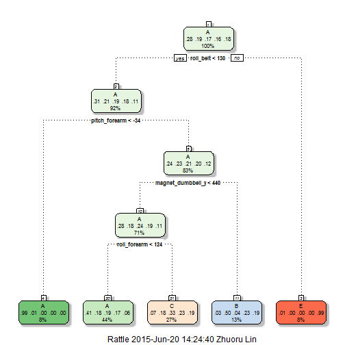

# Data source and background

Using devices such as Jawbone Up, Nike FuelBand, and Fitbit it is now possible to collect a large amount of data about personal activity relatively inexpensively. These type of devices are part of the quantified self movement – a group of enthusiasts who take measurements about themselves regularly to improve their health, to find patterns in their behavior, or because they are tech geeks. One thing that people regularly do is quantify how much of a particular activity they do, but they rarely quantify how well they do it. In this project, your goal will be to use data from accelerometers on the belt, forearm, arm, and dumbell of 6 participants. They were asked to perform barbell lifts correctly and incorrectly in 5 different ways. More information is available from the website here: http://groupware.les.inf.puc-rio.br/har (see the section on the Weight Lifting Exercise Dataset). 

# Goal

The goal of this project is to predict the manner in which they did the exercise. This is the "classe" variable in the training set. 

# Data and predictors selection

The training data are already provided by the project instruction page. But the "testing" set provided does not have the outcomes to check with. Hence I partitioned the training data set into 60% training data and 40% testing data:


```r
library(caret)
alltrain = read.csv("./project/pml-training.csv")
inTrain = createDataPartition(y = alltrain$classe,p = 0.6,list = F)
training = alltrain[inTrain,]
testing = alltrain[-inTrain,]
```


## Counting NAs
Some variables my have large amount of NAs and have no predicton power. 

```r
NAmark = apply(X = training,MARGIN = 2,FUN = is.na)
NAperCol = colSums(NAmark)
```


It shows that these predictors have either 0 or 19216 NAs out of 19622 observation. I decide to choose all the predictors with 0 NAs.


```r
valid_predictor_position = which(NAperCol==0)
predictors_subset = training[valid_predictor_position]
```

## Unneccesary predictors
Although do not have enough understanding of each variable, but I insist that row number and user_name should not predict exercise manner. Also, date and time and window numbers does not seems to affect exercise either. 
Hence the first seven variables from the subset I created above are deleted:

```r
predictors_subset = predictors_subset[-(1:7)]
```

Also delete the outcome "classe" from predictors subset.

```r
predictors_subset = predictors_subset[-86]
```

## No values rows 
There exists some colums that a lot of rows do not have values yet they are not NAs. For example:

```r
head(predictors_subset[5])
```

```
##    kurtosis_roll_belt
## 2                    
## 5                    
## 10                   
## 11                   
## 12                   
## 13
```

In order to delete these columns, I will first convert all columns to numeric. Those observations without a value will be assign NAs. Then delete these columns from the subset.

```r
predictors_subset = apply(predictors_subset,2,as.numeric)#Convert to numeric vector
NACheck = apply(predictors_subset,2,is.na) #Return logic indicators of each observation
NAperCol = colSums(NACheck)#Count NAs of each columns
valid_position = which(NAperCol==0)# Mark down valid columns that without NAs.
predictors_subset = as.data.frame(predictors_subset)
predictors_subset = predictors_subset[valid_position]
```


Finally, I choose 52 out of 159 predictors.

# Model
Because "classe" is a factor of 5 levels. Principal component analysis with general linear regression won't work. I decide to use decision tree. Ramdom forest method should be more accurate but consider the processing time of 52 predictors I should try more efficient decisiont tree model first.

## Decision tree model


```r
treeModel = train(training$classe~.,data = predictors_subset,method = "rpart")
treeModel$finalModel
```

```
## n= 11776 
## 
## node), split, n, loss, yval, (yprob)
##       * denotes terminal node
## 
##  1) root 11776 8428 A (0.28 0.19 0.17 0.16 0.18)  
##    2) roll_belt< 130.5 10784 7445 A (0.31 0.21 0.19 0.18 0.11)  
##      4) pitch_forearm< -33.95 971    7 A (0.99 0.0072 0 0 0) *
##      5) pitch_forearm>=-33.95 9813 7438 A (0.24 0.23 0.21 0.2 0.12)  
##       10) magnet_dumbbell_y< 439.5 8311 5986 A (0.28 0.18 0.24 0.19 0.11)  
##         20) roll_forearm< 123.5 5165 3072 A (0.41 0.18 0.19 0.17 0.058) *
##         21) roll_forearm>=123.5 3146 2112 C (0.074 0.18 0.33 0.23 0.19) *
##       11) magnet_dumbbell_y>=439.5 1502  747 B (0.033 0.5 0.041 0.23 0.19) *
##    3) roll_belt>=130.5 992    9 E (0.0091 0 0 0 0.99) *
```

```r
library(rattle)
fancyRpartPlot(treeModel$finalModel)
```

 

The decision tree model seems to be very good at predicting A and E but are not very accurate at B and C. However in order to access the model we need to do cross-validation on testing set. My expectation for the accuracy in testing set is low. Let's first have a look at how well this model did in training set.

```r
confusionMatrix(data = training$classe, reference = predict(treeModel,predictors_subset))
```

```
## Confusion Matrix and Statistics
## 
##           Reference
## Prediction    A    B    C    D    E
##          A 3048   44  248    0    8
##          B  941  749  589    0    0
##          C  948   61 1045    0    0
##          D  847  357  726    0    0
##          E  297  311  580    0  977
## 
## Overall Statistics
##                                           
##                Accuracy : 0.4941          
##                  95% CI : (0.4851, 0.5032)
##     No Information Rate : 0.5164          
##     P-Value [Acc > NIR] : 1               
##                                           
##                   Kappa : 0.3392          
##  Mcnemar's Test P-Value : NA              
## 
## Statistics by Class:
## 
##                      Class: A Class: B Class: C Class: D Class: E
## Sensitivity            0.5012   0.4921  0.32779       NA  0.99188
## Specificity            0.9473   0.8508  0.88251   0.8361  0.88991
## Pos Pred Value         0.9104   0.3287  0.50876       NA  0.45127
## Neg Pred Value         0.6401   0.9186  0.77957       NA  0.99917
## Prevalence             0.5164   0.1292  0.27072   0.0000  0.08364
## Detection Rate         0.2588   0.0636  0.08874   0.0000  0.08297
## Detection Prevalence   0.2843   0.1935  0.17442   0.1639  0.18385
## Balanced Accuracy      0.7243   0.6715  0.60515       NA  0.94089
```

The accuracy is only about 50%. I expect the performance is closed when the same model is applied to testing set.

```r
confusionMatrix(data = testing$classe, reference = predict(treeModel,testing))
```

```
## Confusion Matrix and Statistics
## 
##           Reference
## Prediction    A    B    C    D    E
##          A 2032   37  157    0    6
##          B  640  537  341    0    0
##          C  639   47  682    0    0
##          D  602  211  473    0    0
##          E  227  175  386    0  654
## 
## Overall Statistics
##                                           
##                Accuracy : 0.4977          
##                  95% CI : (0.4866, 0.5088)
##     No Information Rate : 0.5277          
##     P-Value [Acc > NIR] : 1               
##                                           
##                   Kappa : 0.3428          
##  Mcnemar's Test P-Value : NA              
## 
## Statistics by Class:
## 
##                      Class: A Class: B Class: C Class: D Class: E
## Sensitivity            0.4908  0.53327  0.33448       NA  0.99091
## Specificity            0.9460  0.85656  0.88187   0.8361  0.89034
## Pos Pred Value         0.9104  0.35375  0.49854       NA  0.45354
## Neg Pred Value         0.6245  0.92573  0.79052       NA  0.99906
## Prevalence             0.5277  0.12835  0.25988   0.0000  0.08412
## Detection Rate         0.2590  0.06844  0.08692   0.0000  0.08335
## Detection Prevalence   0.2845  0.19347  0.17436   0.1639  0.18379
## Balanced Accuracy      0.7184  0.69491  0.60817       NA  0.94063
```

The accuracy drop to 49.4%. Which result in an expected out of sample error rate of around 50%. Hence I don't want to use decision tree to make my predictions.

## Ramdom forest model

```r
forestModel = train(training$classe~.,data = predictors_subset,method = "rf",trControl = trainControl(method = "cv",number = 4))
confusionMatrix(data = testing$classe,reference = predict(forestModel,testing))
```

```
## Confusion Matrix and Statistics
## 
##           Reference
## Prediction    A    B    C    D    E
##          A 2229    2    0    0    1
##          B   13 1499    6    0    0
##          C    0   20 1345    3    0
##          D    0    0   32 1253    1
##          E    0    0    1    2 1439
## 
## Overall Statistics
##                                           
##                Accuracy : 0.9897          
##                  95% CI : (0.9872, 0.9918)
##     No Information Rate : 0.2858          
##     P-Value [Acc > NIR] : < 2.2e-16       
##                                           
##                   Kappa : 0.9869          
##  Mcnemar's Test P-Value : NA              
## 
## Statistics by Class:
## 
##                      Class: A Class: B Class: C Class: D Class: E
## Sensitivity            0.9942   0.9855   0.9718   0.9960   0.9986
## Specificity            0.9995   0.9970   0.9964   0.9950   0.9995
## Pos Pred Value         0.9987   0.9875   0.9832   0.9743   0.9979
## Neg Pred Value         0.9977   0.9965   0.9940   0.9992   0.9997
## Prevalence             0.2858   0.1939   0.1764   0.1603   0.1837
## Detection Rate         0.2841   0.1911   0.1714   0.1597   0.1834
## Detection Prevalence   0.2845   0.1935   0.1744   0.1639   0.1838
## Balanced Accuracy      0.9968   0.9913   0.9841   0.9955   0.9991
```

The out of sample accuracy is up to 99%. Hence our best bet is to use ramdom fourest model to give predictions.


# Submission
I will just apply ramdom forest model to predict the 20 testing sample that coursera provide. And use the given function to export txt files to submit predictions homework.


```r
external_test = read.csv("./project/pml-testing.csv")
predictions = predict(forestModel,external_test)
pml_write_files = function(x){
  n = length(x)
  for(i in 1:n){
    filename = paste0("problem_id_",i,".txt")
    write.table(x[i],file=filename,quote=FALSE,row.names=FALSE,col.names=FALSE)
  }
}
pml_write_files(predictions)
```


It ends up with 100% correct on 20 predictions.
